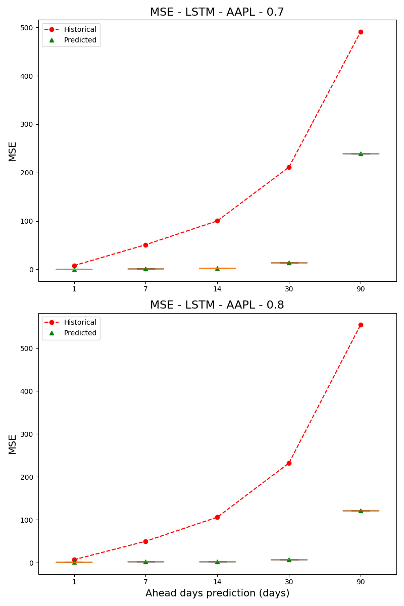

# AI IN FINANCE: TRANSFORMERS APPLIED TO MULTIVARIATE TIME SERIES FORECASTING
Víctor Vallejo's final degree thesis (TFG) of the degree in Data Engineering and Systems at Universidad Politécnica de Madrid (UPM).

## Overview
This project aims to develop an artificial intelligence-based price prediction system for financial markets, leveraging transformative models in a multivariate environment. The architecture is designed to facilitate comparisons between transformer models and other AI technologies, applied to data from 15 different stocks within the S&P 500 index.

See the project's paper for more details:
```bibtex
@article{https://doi.org/10.5281/zenodo.11493274,
  doi = {10.5281/ZENODO.11493274},
  url = {https://zenodo.org/doi/10.5281/zenodo.11493274},
  author = {Vallejo Carmona,  Víctor},
  language = {en},
  title = {AI in Finance: Transformers applied to multivariate time series forecasting},
  publisher = {Zenodo},
  year = {2024},
  copyright = {Creative Commons Attribution 4.0 International}
}
```

## Features

- **Multivariate Data Analysis**: Incorporates data from various sources, including Twitter and Bloomberg sentiment analysis, daily trading volumes, and stock price-related factors.
- **Flexible Configuration**: Simulation scenarios can be customized via a YAML configuration file, allowing adaptability to various forecasting examples and contexts.
- **Multiple AI Models**: Includes different LSTM models (classic, stacked, and attention-based) developed using TensorFlow, and transformer models built with PyTorch.
- **Robust Visualization**: Presents model performance across different stocks and time horizons to evaluate effectiveness in various contexts.

## Data Collection and Preprocessing

- **Sources**: Data is collected from Twitter, Bloomberg, daily trading volumes, and stock price-related factors.
- **Storage**: Preprocessed data is stored in pickle files.
- **Preprocessing Steps**: 
  - Load raw data from CSV files.
  - Calculate sentiment scores.
  - Calculate volatility and trends.
  - Normalize the data for univariate and multivariate datasets.

## Simulation Scenarios

- Defined through a YAML file where users can specify parameters such as:
  - Stock tickers.
  - Train/test split ratios.
  - Window sizes.
  - Number of training iterations, epochs, and batch sizes.
  - Number of hidden neurons.
- Users can select between different LSTM models and customize transformer parameters.

## Model Architectures

### LSTM Models

1. **Basic LSTM**: Captures short-term dependencies.
2. **Stacked LSTM**: Captures more complex patterns.
3. **Attention-based LSTM**: Incorporates an attention mechanism for better prediction accuracy.

### Transformer Model

- Based on the classical architecture, including:
  - Embedding layers.
  - Encoder layers with multi-head attention.
  - Positional feed forward networks.

## Training and Evaluation

- **Optimizer**: AdamW
- **Loss Function**: MSELoss
- **Metrics**: 
  - Mean Squared Error (MSE)
  - Mean Absolute Error (MAE)
- Continuous evaluation to monitor performance and avoid overfitting.
- Predictions are denormalized to original scales.

## Usage

### Running the System

The operation of the system is managed by a flow of Python scripts executed by a main script. Users can choose to:
- Run the entire system.
- Display results from previous runs.

### Requirements

- Python 3.10.12
- TensorFlow
- PyTorch
- Additional dependencies listed in `requirements.txt`

### Load pretrained models
To load the pretrained models to use the .h5 files for the LSTMs you can follow this example:

```python
from tensorflow.keras.models import load_model

# Path to the .h5 file of the model
model = "path_model"
model.summary() #to make sure that the model is ready to use
```

### Installation

1. Clone the repository:
   ```bash
   git clone https://github.com/jordieres/Finance-AI.git
   cd Finance-AI
   ```
2. Install the required packages:
   ```bash
   pip install -r requirement.txt
   ```

### Configuration
Customize the YAML configuration file to specify simulation parameters.

### Execution
Run the main script to start the simulation with the path of the configuration file and the operations to run:
operations: 'pre;lstm;1DT;MDT;post'
   ```bash
   python3 src/main.py -c path_to_config_file.yaml -o [operations]
   ```

## Results
Below are some example graphs of the results obtained from the models predictions:

### Amazon's stock price prediction using LSTM and transformer multivariate for the first of the scenarios.


### Amazon's stock price prediction using LSTM and transformer multivariate for the first of the scenarios.


### Apples's MSE comparison for each ahead value using LSTM and transformer multivariate for the first of the scenarios.




## Contributing
Contributions are welcome!

## Acknowledgments:

Special thanks to the ETSIST Department of Ingeniería de Organización, Administración de Empresas y Estadística for mentoring this project and for providing the data for this study.


